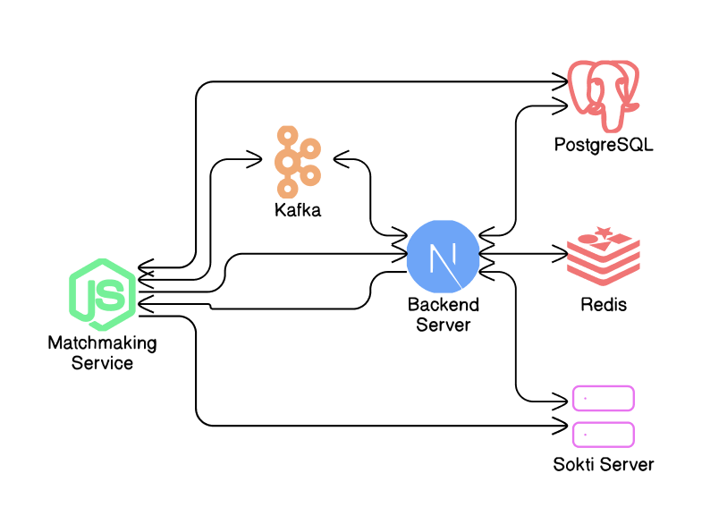

# Teleport

## Application Flow

### User Initiation

- The user accesses the Teleport platform via the Next.js server, inputs their pickup and drop-off addresses, selects a vehicle type, and completes the payment.

### Booking Status - BOOKED

- Upon successful payment, the booking enters a BOOKED state. The Next.js server initiates a matchmaking request with the Matchmaking Service to assign a driver.

### Driver Matchmaking

- The Matchmaking Service identifies available drivers by subscribing to Kafka topics for real-time driver status.
  - It sends a booking request to drivers one-by-one.
  - Each driver has a 10-second window to accept or decline. If declined or ignored, the request moves to the next available driver.

### Driver Acceptance and Booking Status - ACCEPTED

- If a driver accepts, the matchmaking process stops for that booking, and the booking status changes to ACCEPTED.
- Real-time notifications are sent to the user through the Sokti Server (WebSocket), updating the booking status and providing the driver’s details and live location.

### Driver and User Interface Updates

- **User Interface**: The user’s view refreshes to display the driver’s information, live location, distance, and ETA.
- **Driver Interface**: The driver’s screen updates to show pickup details, distance, and ETA for the pickup location.

### Driver Arrival at Pickup Location

- When the driver is within 200 meters of the pickup location, a “Ready to Pick Up” button becomes active on their interface.

### Package Pickup Confirmation

- The user hands the package to the driver, shares an OTP for verification, and the driver confirms the pickup.
- The booking status changes to PICKEDUP, and the user can now track the package in real-time until delivery.

### Driver Arrival at Drop-off Location

- Upon reaching within 200 meters of the drop-off address, the driver can contact the recipient via the phone number provided in the delivery details to request an OTP for delivery completion.

### Delivery Confirmation and Booking Status - DELIVERED

- The driver enters the OTP and marks the package as delivered.
- The booking status updates to DELIVERED, completing the transport.

---

## Technical Architecture

The Teleport application is designed to facilitate the transportation of items by connecting users with a fleet of drivers. To achieve high availability, performance, and real-time interactions, the architecture is built around a microservices pattern, utilizing several technologies to ensure smooth operations.

### 1. Next.js Server

- **Role**: The Next.js server serves as the frontend of the application, responsible for delivering static assets and rendering React components. It also includes backend functionality through serverless APIs built using TRPC (TypeScript Remote Procedure Call).
- **Interaction**:
  - Communicates with the Matchmaking Service to request driver availability and transport options.
  - Retrieves data from the PostgreSQL database for user profiles and historical data.
  - Utilizes Redis for caching frequently accessed data, improving response times.
  - Integrates with the Sokti server to provide real-time updates to users through WebSockets.

### 2. Matchmaking Service (Node.js Service)

- **Role**: This service is responsible for the core logic of matching users with available drivers. It listens for specific events and processes matchmaking based on user requests and driver availability.
- **Interaction**:
  - Subscribes to Kafka topics to receive notifications about driver availability and status changes.
  - Sends matchmaking results back to the Next.js server, updating users with the assigned drivers.
  - Interacts with PostgreSQL to store and retrieve information regarding user requests and driver details.

### 3. Kafka (Message Queue)

- **Role**: Kafka acts as a message broker that enables asynchronous communication between services. It handles events and notifications, ensuring that the system can manage high traffic efficiently.
- **Interaction**:
  - Connects the Matchmaking Service to the driver services, publishing and subscribing to topics related to driver availability, user requests, and status updates.
  - Facilitates communication between the Next.js server and other backend services, allowing for decoupled service interactions.

### 4. Sokti Server (Pusher Server for WebSocket Events)

- **Role**: The Sokti server provides real-time capabilities to the application through WebSockets. It allows for instant updates to users regarding driver status, tracking, and other relevant information.
- **Interaction**:
  - Receives events from the Matchmaking Service regarding driver assignments and status changes, pushing these updates to the Next.js server.
  - Sends WebSocket events to the frontend to ensure users receive real-time notifications about their transport requests.

### 5. PostgreSQL (Primary Database)

- **Role**: PostgreSQL serves as the primary relational database for storing user profiles, driver information, ride history, and other essential data.
- **Interaction**:
  - Interacts with both the Next.js server and Matchmaking Service to retrieve and store data as needed.
  - Ensures data integrity and supports complex queries for reporting and analytics.

### 6. Redis (Primary Cache)

- **Role**: Redis is utilized as a caching layer to improve the performance of the application by storing frequently accessed data in memory.
- **Interaction**:
  - Caches user sessions, driver statuses, and other temporary data to reduce latency and database load.
  - Works closely with the Next.js server to provide quick access to data and enhance user experience.

---

## Overall Flow

1. **User Interaction**: Users access the frontend through the Next.js server, initiating transport requests.
2. **Matchmaking**: The Next.js server communicates with the Matchmaking Service to find available drivers. The Matchmaking Service listens to Kafka topics for real-time driver status updates.
3. **Real-Time Updates**: Once a driver is matched, the Sokti server pushes real-time notifications to the frontend, updating users about their driver’s status.
4. **Data Management**: All persistent data is managed through PostgreSQL, with Redis enhancing performance through caching.
5. **Asynchronous Communication**: Kafka ensures all components communicate efficiently, allowing the system to handle high traffic with minimal latency.
