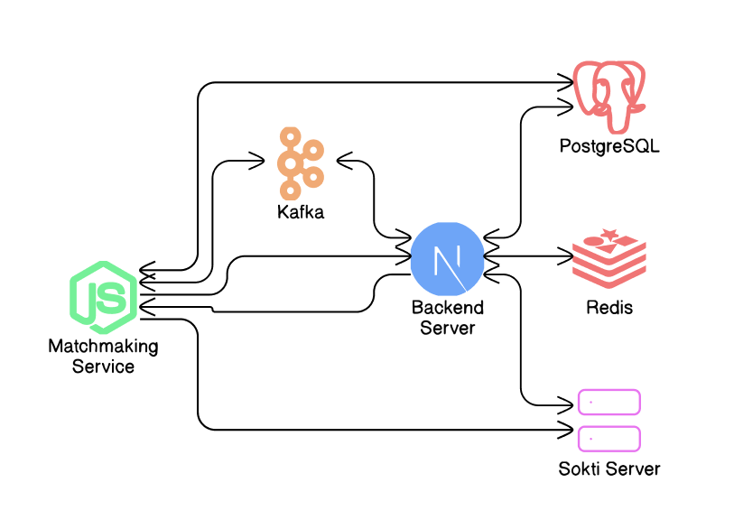

# Teleport

A resilient package delivery platform connecting users with drivers for real-time transportation services.



## Quick Start with Docker

Start the entire application with a single command:

```bash
# Start all services
docker-compose up -d

# View logs
docker-compose logs -f

# Stop all services
docker-compose down
```

### Services Started

| Service | Port | Description |
|---------|------|-------------|
| Application | 3000 | Next.js frontend & API |
| Temporal UI | 8080 | Workflow monitoring dashboard |
| Temporal | 7233 | Temporal server (internal) |
| PostgreSQL | 5432 | Primary database |
| Redis | 6379 | Geolocation & caching |

### Access Points
- **Application**: http://localhost:3000
- **Temporal UI**: http://localhost:8080

## Environment Variables

Create a `.env` file in the root directory (for docker-compose):

```env
# OAuth Providers (required for authentication)
GITHUB_CLIENT_ID=your-github-client-id
GITHUB_CLIENT_SECRET=your-github-client-secret
GOOGLE_CLIENT_ID=your-google-client-id
GOOGLE_CLIENT_SECRET=your-google-client-secret
```

## Local Development

### Prerequisites
- Node.js 20+
- pnpm 9+
- Docker & Docker Compose

### Setup

```bash
# Start infrastructure only
docker-compose up -d redis postgres temporal temporal-ui

# Install dependencies
cd application && pnpm install
cd ../matchmaker && pnpm install

# Generate Prisma client (from application folder)
cd application && pnpm prisma generate

# Run database migrations
pnpm prisma db push

# Start application (terminal 1)
pnpm dev

# Start matchmaker worker (terminal 2)
cd ../matchmaker && pnpm dev
```

---

## Architecture

### Technology Stack

| Component | Technology | Purpose |
|-----------|------------|---------|
| Frontend | Next.js 14 | React UI with SSR |
| API | tRPC | Type-safe API with SSE subscriptions |
| Database | PostgreSQL | Primary data storage |
| Cache | Redis | Geolocation (GEORADIUS) & PubSub |
| Workflow | Temporal | Durable matchmaking orchestration |
| Real-time | tRPC SSE | Server-Sent Events for live updates |

### System Components

```
┌─────────────────────────────────────────────────────────────────┐
│                        Frontend (Next.js)                       │
│  ┌─────────────┐  ┌─────────────┐  ┌─────────────────────────┐ │
│  │   User UI   │  │  Driver UI  │  │  SSE Subscriptions      │ │
│  └──────┬──────┘  └──────┬──────┘  └───────────┬─────────────┘ │
└─────────┼────────────────┼─────────────────────┼───────────────┘
          │                │                     │
          ▼                ▼                     ▼
┌─────────────────────────────────────────────────────────────────┐
│                      tRPC API Layer                             │
│  ┌─────────────┐  ┌─────────────┐  ┌─────────────────────────┐ │
│  │  Mutations  │  │   Queries   │  │  Subscriptions (SSE)    │ │
│  └──────┬──────┘  └──────┬──────┘  └───────────┬─────────────┘ │
└─────────┼────────────────┼─────────────────────┼───────────────┘
          │                │                     │
          ▼                ▼                     ▼
┌─────────────────┐ ┌─────────────┐ ┌─────────────────────────────┐
│    Temporal     │ │  PostgreSQL │ │          Redis              │
│  ┌───────────┐  │ │             │ │  ┌─────────┐  ┌──────────┐  │
│  │ Workflow  │  │ │  Bookings   │ │  │  Geo    │  │  PubSub  │  │
│  │ Signals   │  │ │  Users      │ │  │ RADIUS  │  │  Events  │  │
│  └─────┬─────┘  │ │  Addresses  │ │  └─────────┘  └──────────┘  │
└────────┼────────┘ └─────────────┘ └─────────────────────────────┘
         │
         ▼
┌─────────────────────────────────────────────────────────────────┐
│                   Matchmaker Worker (Temporal)                  │
│  ┌─────────────────────────────────────────────────────────┐   │
│  │              matchmakingWorkflow                         │   │
│  │  1. Find nearby drivers (Redis GEORADIUS)               │   │
│  │  2. Lock driver → Send request → Wait for signal        │   │
│  │  3. On accept: Update DB → Notify user                  │   │
│  │  4. On reject/timeout: Try next driver                  │   │
│  └─────────────────────────────────────────────────────────┘   │
└─────────────────────────────────────────────────────────────────┘
```

---

## Application Flow

### 1. User Initiation
- User accesses the platform, inputs pickup/drop-off addresses, selects vehicle type, and confirms booking.

### 2. Booking Created → Temporal Workflow Started
- Booking saved to PostgreSQL with status `BOOKED`
- Temporal `matchmakingWorkflow` started with booking details

### 3. Driver Matchmaking (Temporal Workflow)
- Workflow queries Redis GEORADIUS for nearby available drivers
- For each driver (closest first):
  - Lock driver temporarily
  - Publish booking request via Redis PubSub → SSE → Driver app
  - Wait for Temporal signal (accept/reject) or timeout (20s)
  - If accepted: workflow completes successfully
  - If rejected/timeout: try next driver

### 4. Driver Acceptance → Status ACCEPTED
- Temporal workflow updates booking status to `ACCEPTED`
- User receives real-time notification via SSE subscription
- Driver and user interfaces update with trip details

### 5. Trip Lifecycle
| Status | Trigger | Description |
|--------|---------|-------------|
| `BOOKED` | User creates booking | Searching for driver |
| `ACCEPTED` | Driver accepts | Driver assigned |
| `ARRIVED` | Driver at pickup | Ready for pickup |
| `PICKED_UP` | Package collected | OTP verified |
| `IN_TRANSIT` | En route | Live tracking |
| `DELIVERED` | Package delivered | Trip completed |

---

## Key Benefits of Temporal Architecture

1. **Durability**: Workflows survive crashes, restarts, and deployments
2. **Visibility**: Full workflow history in Temporal UI
3. **Retries**: Built-in retry logic for transient failures
4. **Timeouts**: Native support for driver response timeouts
5. **Signals**: Clean mechanism for driver accept/reject responses

---

## Project Structure

```
teleport/
├── application/           # Next.js frontend & API
│   ├── src/
│   │   ├── app/          # App router pages
│   │   ├── components/   # React components
│   │   ├── lib/          # Utilities & clients
│   │   ├── server/       # tRPC routers
│   │   └── trpc/         # tRPC client config
│   ├── prisma/           # Database schema
│   └── Dockerfile
├── matchmaker/           # Temporal worker service
│   ├── src/
│   │   ├── activities/   # Temporal activities
│   │   ├── workflows/    # Temporal workflows
│   │   └── worker.ts     # Worker entry point
│   ├── lib/              # Shared utilities
│   └── Dockerfile
├── docker-compose.yml    # Full stack orchestration
└── README.md
```

---

## Monitoring

### Temporal UI (http://localhost:8080)
- View active/completed workflows
- Inspect workflow history and signals
- Debug failed workflows

### Application Logs
```bash
# All services
docker-compose logs -f

# Specific service
docker-compose logs -f matchmaker
docker-compose logs -f application
```
