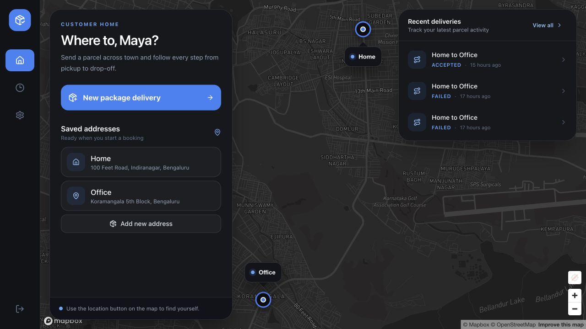
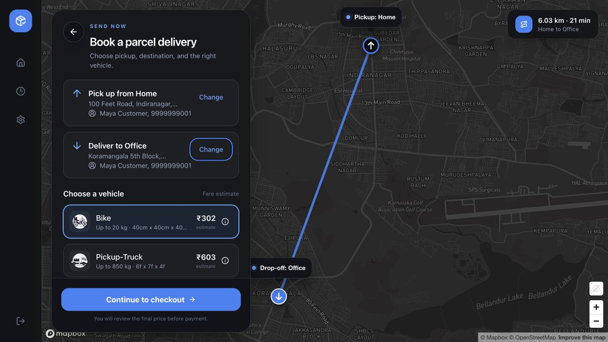
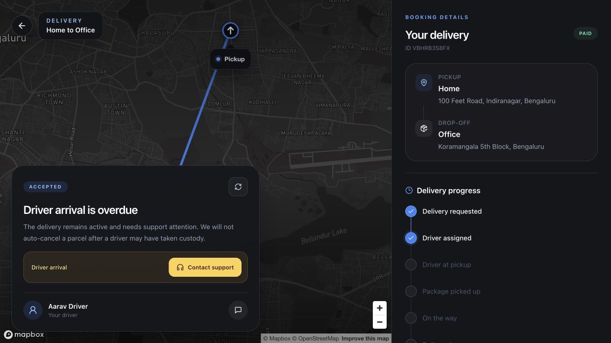
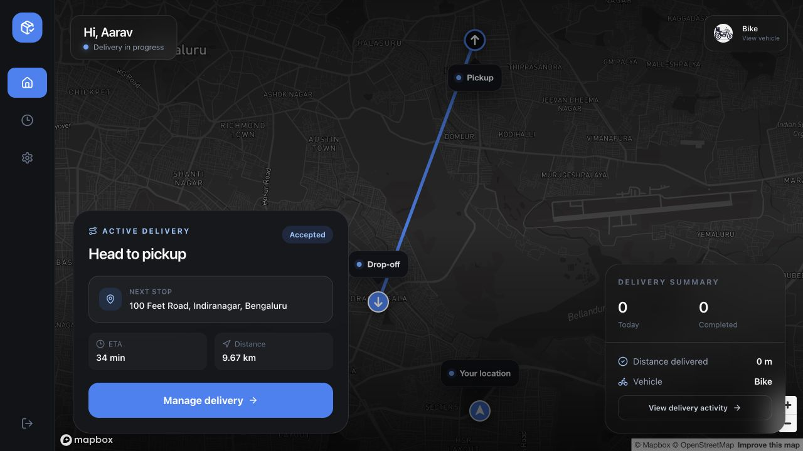
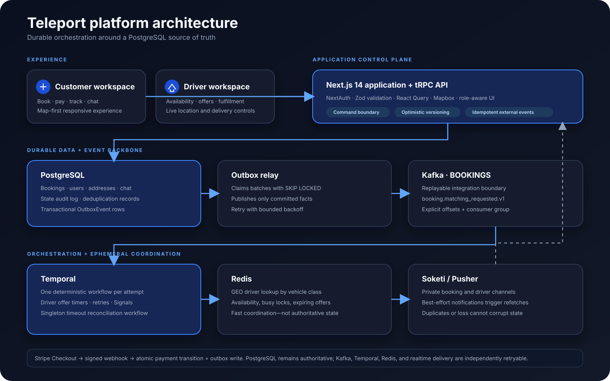
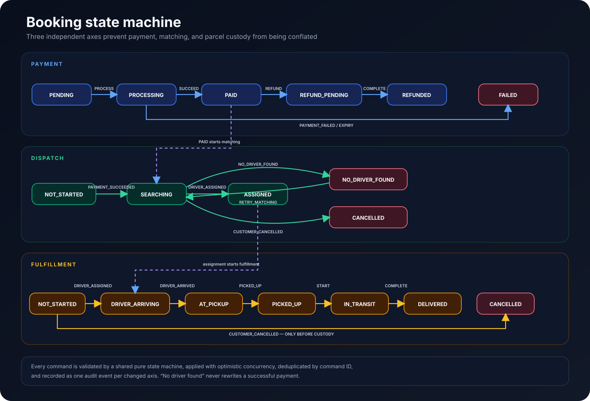

# Teleport

### A real-time local delivery platform built around durable workflows and explicit state ownership.

[](https://vercel.com/new/clone?repository-url=https%3A%2F%2Fgithub.com%2Fvishalx360%2Fteleport&root-directory=application&project-name=teleport-landing)

The public landing page can be deployed without backend credentials. The full booking platform still requires the infrastructure and environment configuration described below.

Teleport is an open-source, full-stack delivery marketplace where customers can book and track a parcel while nearby drivers receive time-bound offers and manage fulfillment. The product is intentionally designed as a platform engineering project: the interesting work lives in the failure boundaries between payments, state transitions, event delivery, workflow retries, geo-discovery, and real-time UX.

> **Project status:** active personal project and production-oriented reference implementation. It runs end to end locally with seeded customer and driver accounts; production deployment still requires managed infrastructure, secrets, observability, and operational runbooks.

## Product tour

| Customer workspace | Route and vehicle selection |
| --- | --- |
| [](docs/screenshots/customer-dashboard.jpg) | [](docs/screenshots/new-delivery.jpg) |

| Live delivery | Driver workspace |
| --- | --- |
| [](docs/screenshots/live-delivery.jpg) | [](docs/screenshots/driver-dashboard.jpg) |

The customer experience separates payment, driver matching, and parcel fulfillment instead of flattening them into one ambiguous status. The driver experience exposes only valid actions for the assigned job and keeps the active route, ETA, vehicle, and operational state visible.

## Why this project exists

Teleport explores the platform concerns behind a deceptively simple “send a package” interaction:

- How do you publish a booking event without losing it between a database commit and Kafka?
- How do you retry matchmaking without assigning two drivers or replaying a side effect twice?
- How do you preserve a successful payment when no driver is available?
- How do you recover long-running timers after a process restart?
- How do you make WebSocket loss harmless to the source of truth?

The implementation answers those questions with a transactional outbox, deterministic Temporal workflows, idempotent command handling, optimistic concurrency, decomposed booking state, and refetch-based real-time events.

## Architecture

[](docs/architecture.svg)

The platform is split into two TypeScript services:

- **Application** — a Next.js 14 web application that owns authentication, customer and driver interfaces, tRPC APIs, Stripe checkout/webhooks, pricing, and the booking command boundary.
- **Matchmaker** — a Node.js worker that relays the transactional outbox, consumes booking events, runs Temporal workers, discovers drivers, manages expiring offers, and applies matchmaking transitions.

### System flow

1. The application creates a pending booking and redirects the customer to Stripe Checkout.
2. A signed Stripe webhook applies the payment transition and writes `booking.matching_requested.v1` to the PostgreSQL outbox in the **same transaction**.
3. The outbox relay claims rows with `FOR UPDATE SKIP LOCKED`, publishes them to the `BOOKINGS` Kafka topic, and retries failed publications with backoff.
4. The Kafka consumer starts `booking-match-{bookingId}-{attempt}`. The deterministic workflow ID makes retained-event replay safe.
5. Temporal coordinates the matching loop, retries Activities, expires each driver offer, and accepts driver responses as Signals.
6. Activities query Redis GEO indexes, reserve a candidate with expiring keys, and send private Soketi/Pusher notifications.
7. Every accepted domain command updates PostgreSQL through the shared transition boundary. Real-time messages only tell clients to refetch; they never carry authority.

### Reliability decisions

| Concern | Design |
| --- | --- |
| Source of truth | PostgreSQL stores the current booking, version, audit history, and external-event deduplication records. |
| Atomic event publication | A transactional outbox couples state changes and integration events without a distributed transaction. |
| Long-running work | Temporal owns matching retries, offer expiry, and timeout reconciliation. Workflow code remains deterministic; Activities perform I/O. |
| Replay safety | Kafka offsets, deterministic workflow IDs, deterministic command IDs, and unique database constraints make duplicate delivery harmless. |
| Concurrent commands | `stateVersion` provides optimistic concurrency; stale writers fail and refetch. |
| Fast coordination | Redis stores geo positions, availability, driver busy locks, and short-lived offers—not durable booking state. |
| Live UX | Soketi/Pusher events trigger a query refetch, so missed or duplicated messages cannot corrupt client state. |
| Payment integrity | Stripe signatures are verified and provider event IDs are deduplicated before transitions are applied. |

## Booking state machine

[](docs/booking-state-machine.svg)

A booking has three independent axes rather than one overloaded status:

- **Payment** is driven by verified payment-provider events. A payment can remain `PAID` while dispatch becomes `NO_DRIVER_FOUND`.
- **Dispatch** covers searching, assignment, retry, and cancellation before parcel custody.
- **Fulfillment** begins with an assigned driver and progresses through pickup, transit, and delivery.

All writers use the same pure TypeScript state machine. Each command is guarded, idempotent by `commandId`, conditionally applied against the previous `stateVersion`, and recorded as one `BookingStateEvent` for every axis it changes. Out-of-order transitions are rejected without mutation, and cancellation is blocked after pickup.

See [the technical state-machine specification](TECHNICAL_STATE_MACHINE_SPEC.md) and [timeout policy](BOOKING_TIMEOUT_POLICY.md) for the complete command, audit, and recovery contracts.

## Platform highlights

- Transactional outbox with batch claiming, stale-lock recovery, and bounded publication backoff
- Kafka event stream with explicit consumer offsets and retained-event replay
- Temporal workflow-per-match-attempt plus a singleton timeout monitor
- Redis GEO search with pipelined availability filtering and expiring driver reservations
- Optimistic concurrency and append-only transition audit records
- Stripe webhook verification and external-event deduplication
- Private booking/driver channels through a Pusher-compatible Soketi server
- Role-aware customer and driver applications with live maps, chat, deadlines, and action guards
- Docker Compose environment for PostgreSQL, Redis, Kafka, Temporal, Temporal UI, and Soketi
- GitHub Actions checks for the worker type system and Prisma schema

## Tech stack

| Layer | Technology |
| --- | --- |
| Web and API | Next.js 14, React 18, TypeScript, tRPC, TanStack Query, Zod |
| UI and maps | Tailwind CSS, Radix UI, Mapbox GL, Zustand |
| Authentication and payments | NextAuth.js, Stripe Checkout and signed webhooks |
| Durable data | PostgreSQL 16, Prisma 7 |
| Events and workflows | Apache Kafka, Temporal |
| Coordination and realtime | Redis, Soketi/Pusher |
| Local platform | Docker Compose, pnpm |

## Repository layout

```text
teleport/
├── application/                 # Next.js customer/driver app and tRPC API
│   ├── prisma/                  # schema, migrations, and local seed
│   └── src/
│       ├── app/                 # routes and API handlers
│       ├── components/          # UI, maps, address and booking components
│       └── server/              # routers, services, auth, and transitions
├── matchmaker/                  # Kafka relay/consumer and Temporal worker
│   ├── lib/                     # infrastructure clients and environment config
│   └── src/workflows/           # deterministic workflows and Activities
├── shared/                      # pure booking state machine and tests
├── docs/                        # architecture, state-machine, and product captures
├── scripts/                     # local setup, dev orchestration, and status checks
└── docker-compose.yml           # local platform dependencies
```

## Run locally

### Prerequisites

- Docker Desktop or a compatible Docker engine
- Node.js 20.19+, 22.12+, or 24.x (**Node 26 is not supported by Prisma 7**)
- pnpm 9.12.1 via Corepack
- A Mapbox public token for rendered maps
- Stripe test credentials only if you want to exercise hosted checkout and webhooks

### Start the platform

```bash
corepack enable
nvm install
nvm use

cd application && pnpm install && cd ..
cd matchmaker && pnpm install && cd ..

pnpm setup:local
pnpm dev
```

Open [http://localhost:3000](http://localhost:3000). With local test authentication enabled, use the seeded customer and driver workspaces from the sign-in page. The local stack also exposes Temporal UI at [http://localhost:8080](http://localhost:8080).

`pnpm setup:local` starts infrastructure, waits for PostgreSQL and Kafka, applies the Prisma schema, generates the client, and seeds local data. It creates missing local environment files without overwriting existing ones. Add the external credentials you need to `application/.env`; never commit that file.

Useful commands:

```bash
pnpm status                       # service health and Kafka consumer lag
pnpm test:state-machine           # pure transition tests
pnpm test:state-machine:integration
pnpm test:matchmaking             # local end-to-end matchmaking smoke test

cd application && pnpm build
cd matchmaker && pnpm exec tsc --noEmit
```

## Design documents

- [Product specification](PRODUCT_SPEC.md) — customer and driver experiences, rules, and launch scope
- [State-machine specification](TECHNICAL_STATE_MACHINE_SPEC.md) — ownership, guards, transaction contract, and migration plan
- [Booking timeout policy](BOOKING_TIMEOUT_POLICY.md) — deadlines, automatic outcomes, and escalation boundaries
- [Matchmaker contract](matchmaker/README.md) — Kafka topic ownership, event contract, and worker configuration
- [Application integration guide](application/README.md) — Stripe and service-specific configuration

## Engineering principles

1. **Committed facts cross service boundaries.** Integration events originate from the outbox, not request handlers.
2. **PostgreSQL answers product questions.** Workflow history and Redis improve execution; neither replaces the operational read model.
3. **Retries are normal.** Every externally triggered transition needs a stable identity and must tolerate replay.
4. **Timers belong to durable orchestration.** Waiting for payment, drivers, or operational deadlines must survive process restarts.
5. **Real-time is an optimization.** The UI can always recover by refetching authoritative state.
6. **Custody changes failure policy.** Before pickup the system may cancel or refund automatically; after pickup it escalates instead of silently terminating a delivery.

## Contributing

Issues and focused pull requests are welcome. Keep changes scoped, preserve the state and event contracts, and include the verification commands you ran. UI changes should include screenshots; workflow changes should include replay-safety reasoning and tests.

Before opening a pull request:

```bash
pnpm test:state-machine
cd application && pnpm build
cd ../matchmaker && pnpm exec tsc --noEmit
```

Do not commit credentials or `.env` files.
